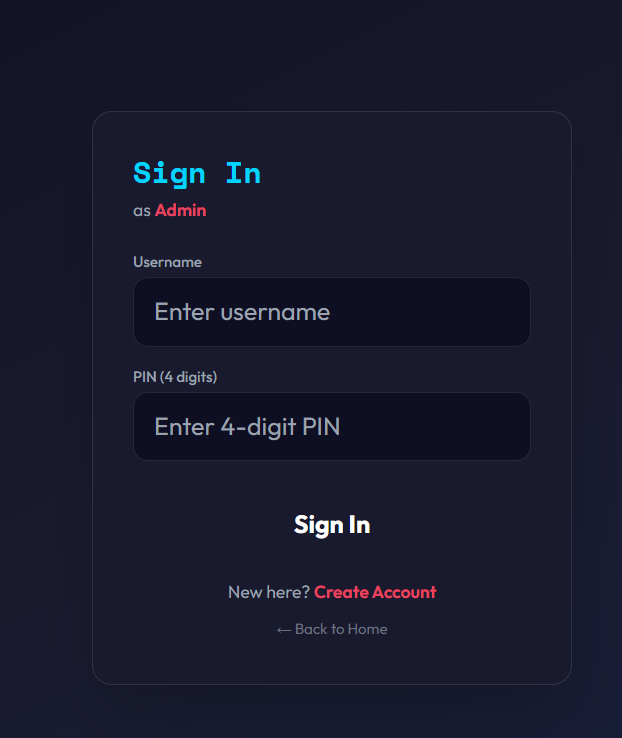
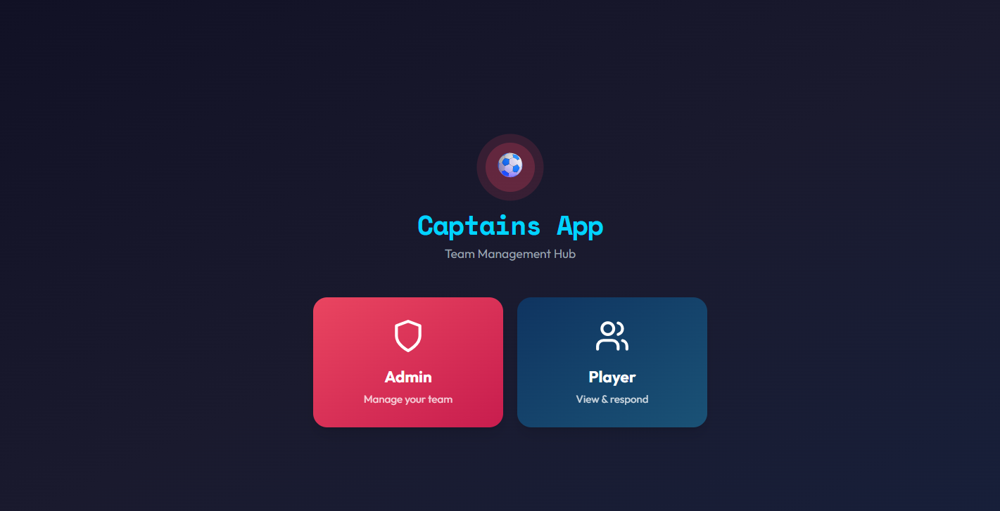
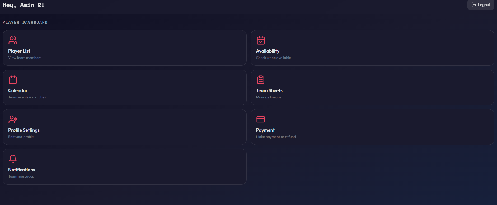
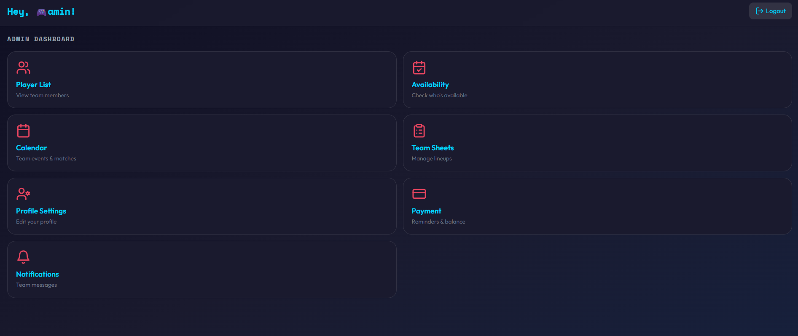

# ⚽ Captains-App

## Overview

Captains-App is a football team management application designed to improve communication and organisation within amateur football teams. The project was created as part of my Software Engineering dissertation and focuses on reducing communication issues by providing a central platform for captains and players.

The application includes a captain-only administration system, player availability management, team announcements, and a simple, user-friendly interface designed through extensive UX research.

---

## Features

- 🔐 Secure login system
- 👨‍✈️ Captain-only administration
- ⚽ Player dashboard
- 📅 Player availability management
- 📢 Team announcements
- 👥 Team management
- 📱 Mobile-first user interface
- 🎨 Designed using Figma

---

## Screenshots

### Login Screen



### Loading Screen



### Player Dashboard



### Admin Dashboard



---

## Application Workflow

The workflow below demonstrates the navigation and interaction between the application's screens.


---

## User Experience Design

This project was designed following a user-centred design approach.

### Research Included

- User Personas
- Application Workflows
- Figma Wireframes
- UI Prototypes
- User Testing
- Design Evaluation

---

## Repository Structure

```
Captains-App
│
├── README.md
├── Screenshots
├── Captains Screen figma Wireframes
│   ├── Application-workflows
│   ├── figma-designs
│   └── User Personas
```

---

## Technologies Used

- HTML
- CSS
- JavaScript
- Figma
- Git
- GitHub
- Prompt Engineering
- Canva AI (Prototype Development)

---

## Design Process

The application was planned before development using:

- User personas to identify user requirements.
- Wireframes to design the interface.
- Workflow diagrams to map user journeys.
- Interactive prototypes created in Figma.
- User testing to improve usability.

---

## Learning Outcomes

Through this project I gained experience in:

- Software Engineering
- User Interface Design
- User Experience Design
- Prompt Engineering
- Prototyping
- Version Control using Git and GitHub
- Documentation
- Requirements Analysis

---

## Future Improvements

Potential future features include:

- Fixture management
- League table integration
- Player statistics
- Push notifications
- Live match updates
- Team chat
- GPS location for away matches

---

## Author

**Ameen Khan**

BSc (Hons) Software Engineering (Game Development)

GitHub: https://github.com/Ameen1738

---

## Licence

This project is available for educational and portfolio purposes.
